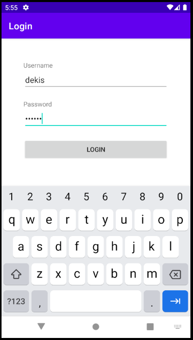
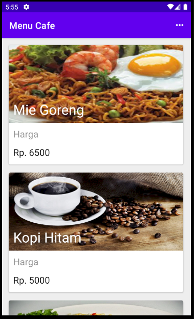
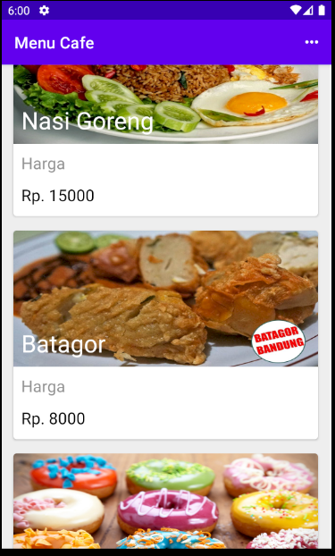
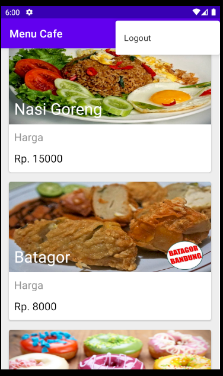

# # CafeApp Description
[](https://android-arsenal.com/details/1/1234)

Untuk memenuhi syarat salah satu tugas `ujian tengah semester` mata kuliah ***Praktikum Pengembangan Aplikasi Mobile***.

## Username:
[](https://android-arsenal.com/details/1/1234)

```
dekis
```

## Password:
[](https://android-arsenal.com/details/1/1234)

```
qwerty
```

# Results
[](https://android-arsenal.com/details/1/1234)

## 1. Login Layout



## 2. Menu Cafe




## 3. Detail Menu


## 4. Logout


